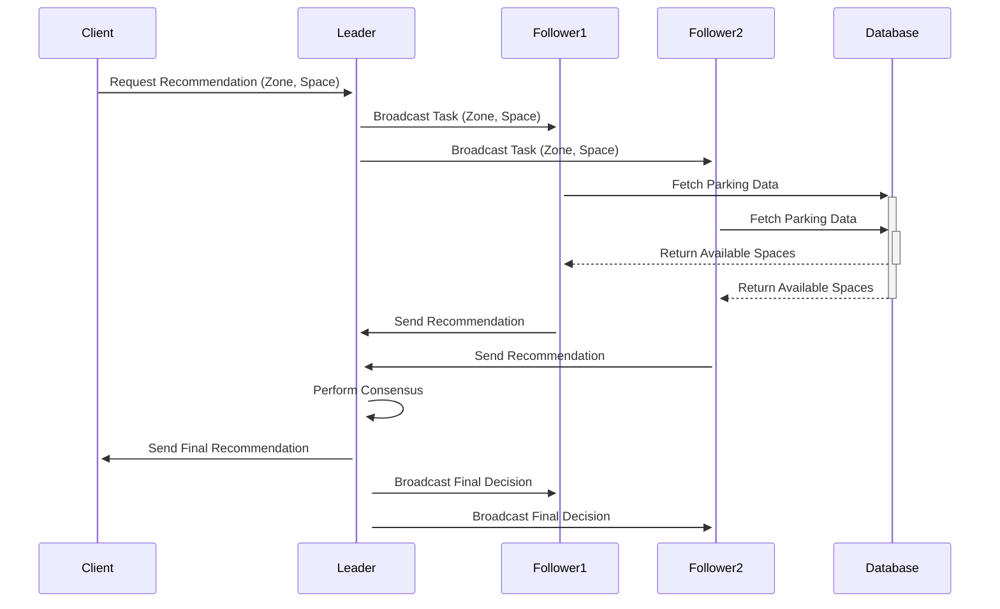

# 🌜 **Recommendation System Protocol Description**
This document outlines the protocol for processing parking space recommendations in a distributed system using RabbitMQ for communication and MongoDB for data storage.

## 📌 **Overview**
- The system consists of a **Leader Node** and multiple **Follower Nodes**.
- Clients send recommendation requests to the **Leader**.
- The **Leader** forwards the task to **Followers**.
- **Followers** generate recommendations and send them back to the **Leader**.
- The **Leader** performs a **consensus** and sends the final decision to all nodes.

---

## 🏢 **Protocol Steps**
1. **Client sends a request** to the Leader via `recommendation_queue`.
2. **Leader receives the request** and **broadcasts** the task to all Followers using `recommendation_task_exchange`.
3. **Followers receive the task**, generate recommendations, and **send** them to the Leader via `leader_recommendation_queue`.
4. **Leader collects recommendations**, performs **consensus**, and **sends** the final decision to all nodes via `leader_final_recommendation`.
5. **Followers receive the final recommendation** and store the results.

---

## 👀 **Message Exchange & Flow**


---

## 🔹 **Message Formats**
### 🎯 **Client Request Message**
```json
{
  "zone": "Zone A",
  "requested_space": "P12"
}
```
📌 **Sent to:** `recommendation_queue`

### 📢 **Leader Broadcast to Followers**
```json
"P12:Zone A"
```
📌 **Sent via:** `recommendation_task_exchange`

### 📩 **Follower Response to Leader**
```json
"Follower1:P12;3,P15;2"
```
📌 **Sent to:** `leader_recommendation_queue`

### 📊 **Final Consensus Message**
```json
"✅ Final Recommended Parking Spaces: P15"
```
📌 **Sent to:** `leader_final_recommendation`

---

## 🏆 **Consensus Algorithm**
- The **Leader** collects responses from **Followers**.
- A **majority vote** is used to determine the best parking space.
- The **final decision** is broadcast to all nodes.

---


