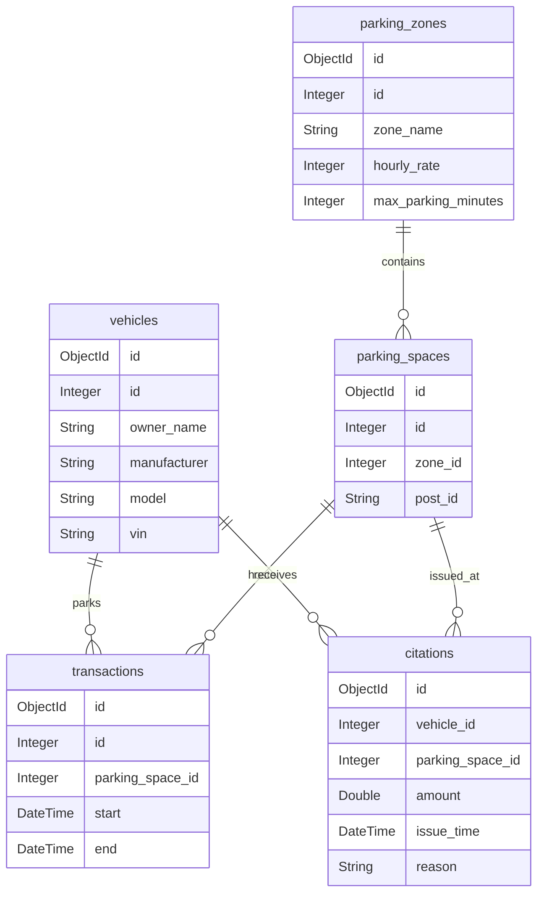

# Database Design Document

## 1. Database Overview
The system uses MongoDB as the database to manage parking zones, spaces, vehicles, and transactions. 
It supports aggregation queries to fetch available parking spots, identify overtime parking, and analyze transaction statistics.

## 2. Database Schema Diagram

## 3. Collection Details
### a. Vehicles
Stores information about registered vehicles.

- **Collection Name:** `vehicles`
- **Schema:**
  | Field         | Type       | Description                     |
  |---------------|------------|---------------------------------|
  | `_id`         | ObjectId   | Unique identifier               |
  | `id`          | Integer    | Vehicle ID                      |
  | `owner_name`  | String     | Owner's full name               |
  | `manufacturer`| String     | Vehicle manufacturer            |
  | `model`       | String     | Vehicle model                   |
  | `vin`         | String     | Vehicle Identification Number   |

---

### b. Parking Zones
Defines parking zones with hourly rates and maximum allowed parking duration.

- **Collection Name:** `parking_zones`
- **Schema:**
  | Field                | Type      | Description                      |
  |----------------------|-----------|----------------------------------|
  | `_id`                | ObjectId | Unique identifier               |
  | `id`                 | Integer  | Zone ID                         |
  | `zone_name`          | String   | Name of the parking zone         |
  | `hourly_rate`        | Integer  | Hourly parking rate              |
  | `max_parking_minutes`| Integer  | Maximum parking duration (mins)  |

---

### c. Parking Spaces
Defines individual parking spaces within zones.

- **Collection Name:** `parking_spaces`
- **Schema:**
  | Field       | Type       | Description                      |
  |-------------|------------|----------------------------------|
  | `_id`       | ObjectId   | Unique identifier               |
  | `id`        | Integer    | Space ID                        |
  | `zone_id`   | Integer    | Foreign key to `parking_zones`  |
  | `post_id`   | String     | Identifier for the space (e.g., A1) |

---

### d. Transactions
Records parking transactions.

- **Collection Name:** `transactions`
- **Schema:**
  | Field              | Type       | Description                          |
  |--------------------|------------|--------------------------------------|
  | `_id`              | ObjectId   | Unique identifier                   |
  | `id`               | Integer    | Transaction ID                      |
  | `parking_space_id` | Integer    | Foreign key to `parking_spaces`     |
  | `start`            | DateTime   | Start time of the transaction       |
  | `end`              | DateTime   | End time of the transaction (nullable) |

---

### e. Citations
Added based on the codebase:

- **Collection Name:** `citations`
- **Schema:**
  | Field              | Type       | Description                          |
  |--------------------|------------|--------------------------------------|
  | `_id`              | ObjectId   | Unique identifier                   |
  | `vehicle_id`       | Integer    | Foreign key to `vehicles`           |
  | `parking_space_id` | Integer    | Foreign key to `parking_spaces`     |
  | `amount`           | Double     | Citation amount                     |
  | `issue_time`       | DateTime   | When the citation was issued        |
  | `reason`           | String     | Reason for citation                 |

---

## 4. Key Queries

### a. Fetch Available Parking Spots
Returns available parking spaces with details like zone name, hourly rate, and maximum duration.

- **Code Reference:** `AvailableParkingSpots.fetchAvailableSpots`
- **Aggregation Pipeline:**
  1. Lookup `parking_zones` for each `parking_space`.
  2. Join with `transactions` to exclude spaces with ongoing transactions.
  3. Project the fields: `parking_space`, `parking_zone`, `hourly_rate`, and `max_parking_duration`.

---

### b. Fetch Overtime Parking Events
Identifies parking events exceeding the maximum allowed duration.

- **Code Reference:** `OvertimeParkingEvents.fetchOvertimeEvents`
- **Aggregation Pipeline:**
  1. Lookup `parking_zones` for each transaction.
  2. Add elapsed time in minutes since the start of the transaction.
  3. Filter transactions where `elapsed_minutes > max_parking_minutes`.
  4. Project fields: `id`, `elapsed_minutes`, `max_parking_minutes`, and `zone_name`.

---

### c. Fetch Transaction Statistics by Hour
Groups transactions by their start hour and counts them.

- **Code Reference:** `TransactionStatsByHour.fetchTransactionStats`
- **Aggregation Pipeline:**
  1. Extract the hour from the `start` field.
  2. Group transactions by the extracted hour.
  3. Sort results by hour.

---

## 5. Data Seeding
The system uses JSON files for seeding initial data:
- Vehicles: `vehicles.json`
- Parking Zones: `parking_zones.json`
- Parking Spaces: `parking_spaces.json`
- Uses transactional inserts to ensure consistency.

## 6. System Integration
- MongoDB Connection: Managed via `MongoDBConnector` using connection string from environment variables
- Collections are dropped and reseeded during system initialization
- Supports transaction management using
