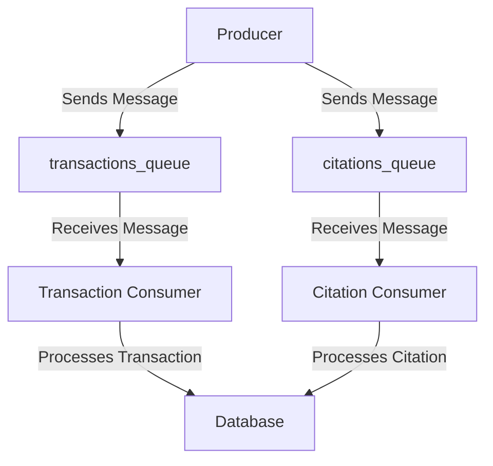

# Queue Server Design Document

## 1. Overview
The Queue Server is responsible for managing the communication between different components of the application using RabbitMQ. It facilitates the sending and receiving of messages related to transactions and citations, ensuring reliable and efficient processing.

## 2. Architecture
The Queue Server architecture consists of the following components:

- **RabbitMQ Server**: The message broker that handles the queuing of messages.
- **Producers**: Components that send messages to the RabbitMQ server. In this system, the `RabbitMQSender` class acts as a producer for transactions and citations.
- **Consumers**: Components that receive messages from the RabbitMQ server. These include services that process transactions and citations.
- **Queues**: Named buffers that store messages until they are processed. The system uses separate queues for transactions and citations.

## 3. Message Flow
1. **Sending Messages**: Producers send messages to the appropriate queue (e.g., `transactions_queue` or `citations_queue`).
2. **Receiving Messages**: Consumers listen to their respective queues and process incoming messages.
3. **Acknowledgment**: After processing a message, consumers acknowledge receipt to RabbitMQ, allowing the message to be removed from the queue.

## 4. Diagram

## 5. Key Features
- **Asynchronous Processing**: The Queue Server allows for non-blocking communication between components, improving system responsiveness.
- **Scalability**: Additional consumers can be added to handle increased load without modifying the producer logic.
- **Error Handling**: The system can implement retry mechanisms for failed message processing, ensuring reliability.

## 6. Conclusion
The Queue Server design leverages RabbitMQ to facilitate efficient communication between application components. By using a producer-consumer model, the system can handle transactions and citations effectively, ensuring a smooth user experience.

